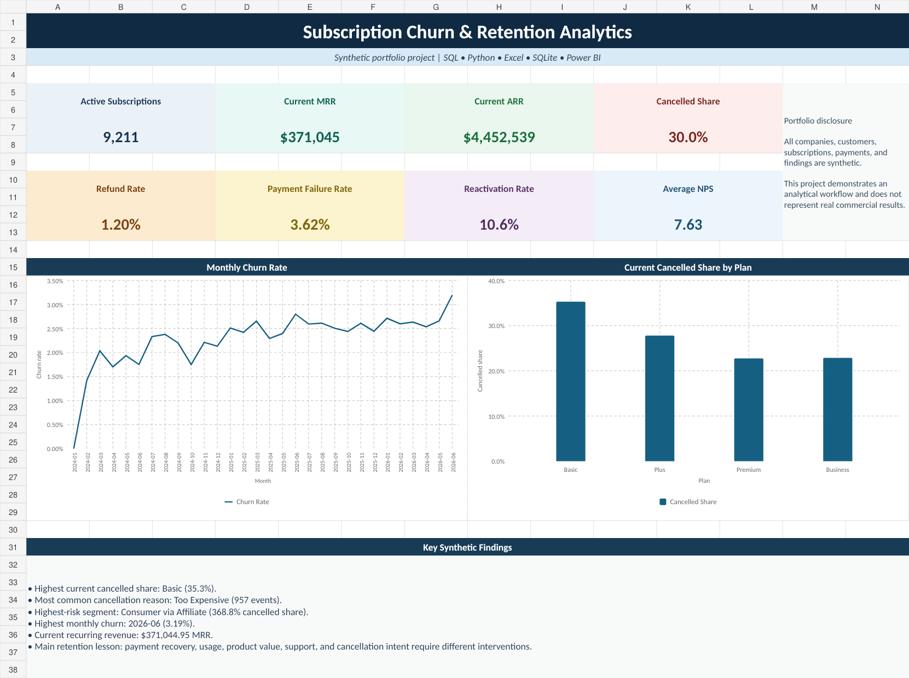
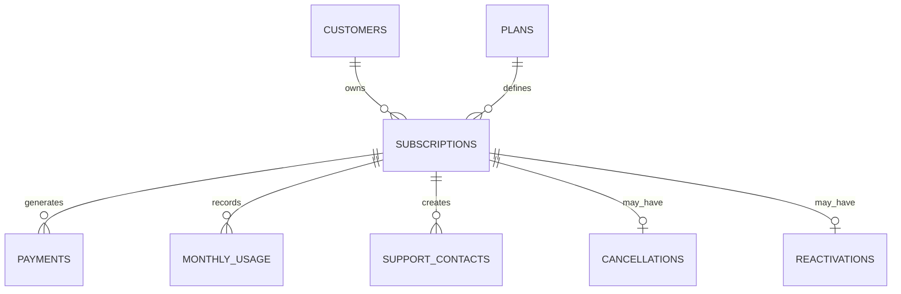

# Subscription Churn & Retention Analytics

End-to-end data analytics portfolio project using **SQL, Python, Excel, SQLite,
and Power BI**.

> **Disclosure:** Helio Subscription Services, its customers, subscriptions,
> payments, and all findings in this repository are fictional. The dataset is
> synthetic and was created solely for portfolio demonstration.

## Project overview

A fictional subscription company needs to understand churn, recurring revenue,
payment failures, refunds, product usage, customer support, cancellation reasons,
reactivation, and cohort retention. This project builds a reproducible analytical
workflow from raw data through business recommendations.

## Portfolio snapshot

| Metric | Result |
|---|---:|
| Total subscriptions | 13,156 |
| Active subscriptions | 9,211 |
| Current cancelled share | 30.0% |
| Current MRR | $371,044.95 |
| Current ARR | $4,452,539.40 |
| Payment records | 177,095 |
| Collected revenue | $6,641,050.89 |
| Refund rate | 1.20% |
| Payment failure rate | 3.62% |
| Cancellation events | 4,443 |
| Reactivation events | 470 |
| Average NPS | 7.63/10 |

## Excel dashboard preview



## Business questions

- How is churn changing over time?
- Which plans and customer segments have weaker retention?
- Which cancellation reasons generate the most subscription loss?
- How are usage, payment issues, and support experience associated with churn?
- How much MRR and ARR is generated by active subscriptions?
- Which acquisition channels produce stronger retention?
- How effective are save offers and reactivation channels?
- How does cohort retention develop through month 12?

## Tools demonstrated

- **SQL:** joins, aggregations, CTEs, cohort analysis, financial validation, and lifecycle queries
- **Python:** pandas cleaning, validation, KPI calculation, export, and SQLite queries
- **Excel:** executive dashboard, plan analysis, segment analysis, cancellation reasons, and cohort heatmap
- **Power BI:** relational model, DAX measures, and dashboard specification
- **SQLite:** portable relational database and analytical view
- **GitHub:** professional documentation and reproducible project structure

## Data model



## Key findings

- **Basic** had the highest current cancelled share at
  **35.3%**.
- **Too Expensive** was the most common cancellation
  reason with **957 events**.
- The highest-risk segment was **Consumer via
  Affiliate**, with a cancelled share of
  **368.8%**.
- The highest monthly churn rate occurred in **2026-06**
  at **3.19%**.
- Payment recovery, usage, product value, support, and cancellation intent require
  different retention interventions.

## Recommended repository order

1. [`documentation/BUSINESS_CASE.md`](documentation/BUSINESS_CASE.md)
2. [`documentation/EXECUTIVE_SUMMARY.md`](documentation/EXECUTIVE_SUMMARY.md)
3. [`data_dictionary.md`](data_dictionary.md)
4. [`sql/`](sql/)
5. [`python/`](python/)
6. [`excel/`](excel/)
7. [`power-bi/`](power-bi/)

## Repository structure

```text
subscription-churn-retention-analytics/
├── data/
│   ├── raw/
│   └── processed/
├── sql/
├── python/
├── excel/
├── power-bi/
├── images/
├── documentation/
├── data_dictionary.md
└── README.md
```

## Run the Python analysis

```bash
pip install -r python/requirements.txt
python python/analysis_pipeline.py
```

## Query the SQLite database

Open `data/processed/subscription_churn_retention.db` with DB Browser for SQLite
and run the scripts in the `sql` folder.

## Limitations

The data-generating process intentionally creates subscription lifecycle patterns
for analysis. Results do not represent a real company, prove causal relationships,
or validate a production retention model.
