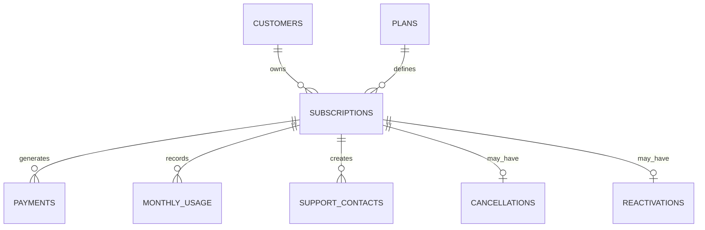

# Data model

Subscriptions are the central portfolio table. Payments represent financial
activity, monthly usage represents engagement, support contacts represent
customer experience, and cancellation/reactivation tables represent lifecycle
events.
